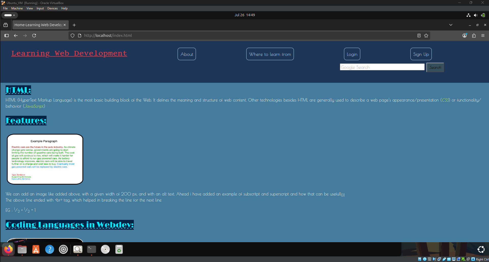

# Apache Website Hosting on Ubuntu VM

This project demonstrates how I hosted a multi-page static website using Apache on an Ubuntu Virtual Machine running inside Oracle VirtualBox.

---

##  What I Did

- Set up Ubuntu 22.04 LTS on VirtualBox (on my personal laptop)
- Installed and configured Apache2 server
- Manually mounted `VBoxGuestAdditions.iso` to enable:
  - Full-screen resolution
  - Clipboard sharing
  - Shared folders (used to transfer website files)
- Copied my complete website (HTML, CSS, images) into `/var/www/html/`
- Managed file permissions using `chown` and `chmod`
- Successfully accessed the hosted site via `localhost` in the VM browser

---

##  Screenshot

> Screenshot showing the website running in the Ubuntu VM:

---

##  Skills Demonstrated

- Virtual Machine setup and system configuration
- Apache web server installation and usage
- Linux command-line (permissions, file navigation)
- Manual network and file integrations using Guest Additions
- Static website structure and deployment

